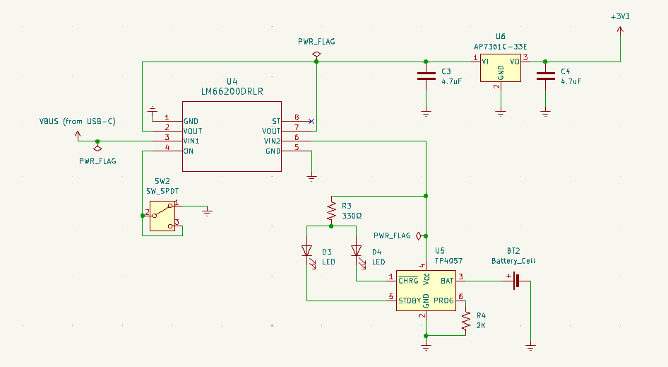
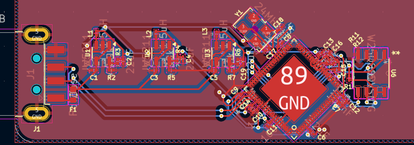

# Cool card PCB

This is my first PCB project. It took me around 20 hours.
It is a small Linux computer that is the size of a business card. Based off of Allwinner F1C200s.

Around $5 or so per card? It is not too bad.

## 3d render

To print, make sure that you select 2-layer PCB.

## Schematic

